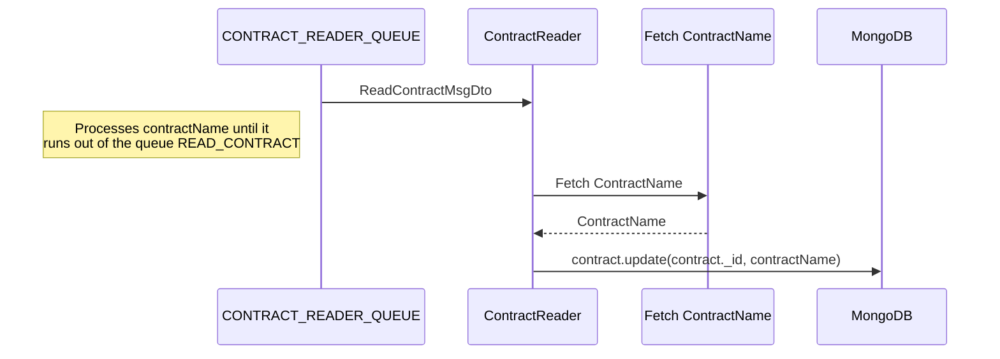
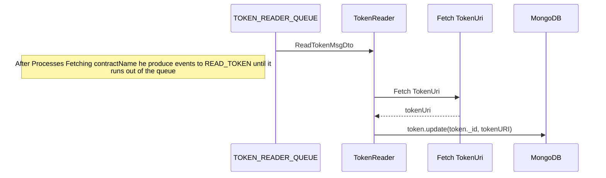

# app-contract-reader

## Description

Microservice based application that consumes [READ_CONTRACT & READ_TOKEN events](https://github.com/LedgerHQ/nft-indexer-evm/blob/main/src/app-contract-reader#read-contract-event) produced by [app-indexer](https://github.com/LedgerHQ/nft-indexer-evm/tree/main/src/app-indexer#readme).
Contract reader updates contract name on READ_CONTRACT event and update token URI on READ_TOKEN event.

## Data flow

Data flow how Contract reader is working

READ_CONTRACT EVENT



READ_TOKEN EVENT



### Limitations

Limitation can be events throughput, Instance CPU and memory, number of concurrent contract read calls made to node, number of updates on token and contract table DB can handle.

### API

## Metrics endpoint

Replace `8090` with a value which was specified in `.env` file for `APP_PORT`:

GET https://localhost:8090/metrics

### About metrics

metrics:<br/>
tasks_gauge - It's number of concurrent tasks<br/>
fetch_contract_name_gauge - how much time it takes to fetch contract name from node <br/>
update_contract_gauge - how much time takes to update contract entry in DB <br/>
update_contract_counter - how many contracts were updated <br/>
fetch_uri_gauge - how much time it takes to fetch token URI from node <br/>
update_token_gauge - how much time takes to update contract entry in DB <br/>
update_erc721_token_counter - updated ERC-721 token counter <br/>
update_erc1155_token_counter - updated ERC-1155 token counter <br/>

## How to run

Before running locally, you need to run the components that Contract Reader app interacts with in docker, and after that already run the `contract-reader` script:

### Local launch with RMQ (script: app-contract-reader:queue)

```shell
$ git clone path/to/git/repository.git
$ npm i
$ npm run start:mongo
$ npm run start:rabbit
$ npm run app-contract-reader
```

## How to test

### Run all tests locally

```shell
$ npm run start:mongo
$ npm run test <you can specify a specific test file to run>
```

### Run all tests in Docker

```shell
$ npm run test:docker
```

###

A lot of tests use snapshots to compare results. If tests have changed and snapshots need to be recreated, then you need to use a special flag for this:

```shell
$ npm run test -- -u
```

---

## Interface

Event Queue Interface which consume events READ_CONTRACT & READ_TOKEN

### DTO schemas

The CONTRACT Reader receives the ReadContractMsgDto object when working with the queue:
#READ_CONTRACT Payload

```typescript
export class ReadContractMsgDto {
  @IsEnum(Blockchain)
  public readonly blockchainName!: Blockchain;

  @IsNumber()
  public readonly blockNumber!: number;

  @IsString()
  public readonly contractAddress!: string;

  @IsEnum(TokenStandard)
  public readonly contractType!: TokenStandard;

  @IsString()
  public readonly tokenId!: string;
}
export enum Blockchain {
  ETH = "eth",
}
export enum TokenStandard {
  ERC721 = "ERC-721",
  ERC1155 = "ERC-1155",
}
```

The Token Reader receives the ReadTokenMsgDto object when working with the queue:

#READ_TOKEN

```typescript
export interface ReadTokenMsgDto {
  blockchainName: Blockchain;
  blockNumber: number;
  contractAddress: string;
  contractType: TokenStandard;
  tokenId: string;
  tokenUri: string;
}
```

### Events types

```typescript
export enum ServiceEvents {
  READ_CONTRACT = "READ_CONTRACT",
  READ_TOKEN = "READ_TOKEN",
}
```

### Table schemas

#### note

Token id is composite key which consists of 3 parts ${blockchain}:${contractAddress}:${tokenId}.<br/>
Example eth:0x8Ce66fF0865570D1ff0BB0098Fa41B4dc61E02e6:0x0747 where eth is key of Ethereum blockchain.

#TOKEN SCHEMA

```typescript
export type Token = {
  _id: string;
  block: number;
  tokenUri: string | null;
  count: number;
  createdAt: Date;
  updatedAt?: Date | null;
};
```

#CONTRACT SCHEMA

```typescript
export type Contract = {
  _id: string;
  address: string;
  type: TokenStandard;
  name: string | null;
  block: number;
  createdAt: Date;
  updatedAt?: Date | null;
};
```

Example of the `contract` document:

```json
{
  "_id": "eth:0x9FB2EEb75754815c5Cc9092Cd53549cEa5dc404f",
  "address": "0x9FB2EEb75754815c5Cc9092Cd53549cEa5dc404f",
  "block": 14316461,
  "createdAt": {
    "$date": {
      "$numberLong": "1653925639144"
    }
  },
  "name": "Superlative Mutated Apes",
  "type": "ERC-721",
  "updatedAt": {
    "$date": {
      "$numberLong": "1654001190604"
    }
  }
}
```

Example of the `token` document:

```json
{
  "_id": "eth:0x8Ce66fF0865570D1ff0BB0098Fa41B4dc61E02e6:0x0747",
  "block": 14316462,
  "tokenUri": "https://bapesclan.mypinata.cloud/ipfs/QmZZbo8u8zEWg7wtmZhJS2W718WL6FA95T4XdgmCcLp1SJ/1863.json",
  "count": 1,
  "createdAt": {
    "$date": {
      "$numberLong": "1653925639685"
    }
  },
  "updatedAt": {
    "$date": {
      "$numberLong": "1654001191186"
    }
  }
}
```

## Dependencies

### Nestjs dependencies

#### Nest Overview

Nest (NestJS) is a framework for building efficient, scalable Node.js server-side applications. It uses progressive JavaScript, is built with and fully supports TypeScript (yet still enables developers to code in pure JavaScript) and combines elements of OOP (Object Oriented Programming), FP (Functional Programming), and FRP (Functional Reactive Programming).
See [nestjs](https://docs.nestjs.com/)

- [@nestjs/common](https://www.npmjs.com/package/@nestjs/common)
- [@nestjs/microservices](https://www.npmjs.com/package/@nestjs/microservices)
- [@nestjs/config](https://www.npmjs.com/package/@nestjs/config)
- [@nestjs/platform-express](https://www.npmjs.com/package/@nestjs/platform-express)
- [@nestjs/core](https://www.npmjs.com/package/@nestjs/platform-express)

### Other dependencies

- [prom-client](https://www.npmjs.com/package/prom-client) - a prometheus client for Node.js that supports histogram, summaries, gauges and counters;
- [ethers](https://www.npmjs.com/package/ethers) - a complete Ethereum wallet implementation and utilities in JavaScript (and TypeScript);
- [mongodb](https://www.npmjs.com/package/mongodb) - the official MongoDB driver for Node.js;
- [pino](https://www.npmjs.com/package/pino) - pino logger;
