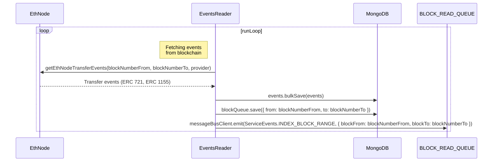

# app-events-reader
***
## Description
Events Reader is a microservice-based application whose main goal is to fetch all events from the blockchain and write them to the database.  
The Events Reader also acts as a producer that generates an [ServiceEvents.INDEX_BLOCK_RANGE](https://github.com/LedgerHQ/nft-indexer-evm/blob/05eba98e93b0ad6a2f9cd7fac9ed2f258ff34452/src/app-events-reader/events-reader/events-reader.service.ts#L96) event and passes it the range of blocks it has traversed. The data consumer for this event is the [app-indexer](https://github.com/LedgerHQ/nft-indexer-evm/tree/main/src/app-indexer).
***
## Data flow


***
## Transfer events in contracts ERC721/ERC1155
NFT contract is two standards: ERC721 and ERC1155.
Each contract has its own transfer events (token transfer). ERC721 has one event - `Transfer`. ERC1155 has two of them: `TransferSingle` (transfer of one token) and `TransferBatch` (transfer of collections of tokens).

To receive events, the Event Reader uses the `getLogs` RPC method of the node. In the `getLogs` method, we take the signatures of these events and set them as topics. What does this mean: the service takes the range block that we indicated to it and catches only those events that fit these topics, it skips all other events.

It's important to know:  
When someone mints a token, and it doesn't yet exist anywhere (it is just being created), then a transfer event is created with a special structure: the sender is the null address, and the recipient is the recipient's address.

As a result, we go through all the logs that correspond to all topics and weed out those whose sender address is not zero, because we are not interested in who owns the token, we are only interested in the presence of the topic itself.

It's important to know:  
ERC721 and ERC20 have similar event signatures, so when we get all these events, we also get ERC20 events that we don't need. Thus, we filter out ERC20 by the number of topics. ERC20 has 3 topics and ERC721 has 4 topics.

The implementation of receiving events can be seen in [events.ts](https://github.com/LedgerHQ/nft-indexer-evm/blob/53907e2ff91af300c5384cd44a91bcd371b1e3f6/src/shared/ethnode/events.ts).

***
## Metrics
To collect information about what is happening in the application, we use various metrics (a bunch of Prometheus and Grafana):
- blockCounter - how many blocks the app has passed so far;
- eventCounter - how many events the app has fetched in general at the moment;
- eventsGauge - how many events in a particular block range that we check;
- fetchEventsGauge - time it takes to pull events for a specific block range;
- saveEventsGauge - time to save to the database;
- totalGauge - how many events were requested during the service operation;

***
## How to run
The app-events-reader works as a REST API and has few endpoints for start/stop indexing.

### Local launch (script: app-events:reader)

Before running API locally, you need to run the components that app-events-reader interacts with in docker, and after that already run the app-events-reader script:
```shell
$ git clone path/to/git/repository.git
$ npm i
$ npm run start:mongo
$ npm run start:rabbit
$ npm run app-events-reader
```
###  Launch in Docker

```shell
$ npm run app-events-reader:docker
```

### Access API

Replace `8080` with a value which was specified in `.env` file for `EVENTS_READER_API_PORT`:

- http://localhost:8080/_health

### Access Swagger OpenAPI docs:

Replace `8080` with a value which was specified in `.env` file for `EVENTS_READER_API_PORT`:

- http://localhost:8080/swagger-api/#/

***
## How to test

### Run all tests locally
```shell
$ npm run start:mongo
$ npm run test <you can specify a specific test file to run>
```

### Run all tests in Docker
```shell
$ npm run test:docker
```

### 
A lot of tests use snapshots to compare results. If tests have changed and snapshots need to be recreated, then you need to use a special flag for this:
```shell
$ npm run test -- -u
```
***
## Interface

### Message schemas

Events Reader app only writes data to the BLOCK_READ_QUEUE. Writes data about the passed block range:  
`{ blockFrom: blockNumberFrom, blockTo: blockNumberTo }`

### Table schemas

Events  Reader interacts with two MongoDB collections:
- `blocks_queue` - contains information about the block range, which we have already checked for events;
- `events` - contains all the events that we found in the blockchain;

Example of the `blocks_queue` document:
```json
{
  "_id": {
    "$oid": "62c428978386a464b517113f"
  },
  "from": 15081366,
  "to": 15081375,
  "createdAt": {
    "$date": {
      "$numberLong": "1657022615822"
    }
  }
}
```

Example of the `events` document:
```json
{
  "_id": "15081367:0xa80046b0d318cee2ceeb38c7458848e04201a1a1a105b15f4c832242e2d73f8a:41",
  "blockNumber": 15081367,
  "contractAddress": "0x57f1887a8BF19b14fC0dF6Fd9B2acc9Af147eA85",
  "logIndex": 41,
  "type": "ERC-721",
  "from": "0x0000000000000000000000000000000000000000",
  "to": "0x283Af0B28c62C092C9727F1Ee09c02CA627EB7F5",
  "ids": [
    "0x91216c80aafa17b52110939872a61bb5da9d3b5dbfcca0124101ad855d53ec15"
  ],
  "values": [
    1
  ],
  "createdAt": {
    "$date": {
      "$numberLong": "1657022615793"
    }
  }
}
```
***
## Dependencies

### Nestjs dependencies
- [@nestjs/common](https://www.npmjs.com/package/@nestjs/common)
- [@nestjs/microservices](https://www.npmjs.com/package/@nestjs/microservices)
- [@nestjs/config](https://www.npmjs.com/package/@nestjs/config)
- [@nestjs/platform-express](https://www.npmjs.com/package/@nestjs/platform-express)
- [@nestjs/core](https://www.npmjs.com/package/@nestjs/platform-express)

### Other dependencies
- [prom-client](https://www.npmjs.com/package/prom-client) - a prometheus client for Node.js that supports histogram, summaries, gauges and counters;
- [ethers](https://www.npmjs.com/package/ethers) - a complete Ethereum wallet implementation and utilities in JavaScript (and TypeScript);
- [mongodb](https://www.npmjs.com/package/mongodb) - the official MongoDB driver for Node.js;
- [aws-sdk](https://www.npmjs.com/package/aws-sdk)
- [commander](https://www.npmjs.com/package/commander) - the complete solution for node.js command-line interfaces;


