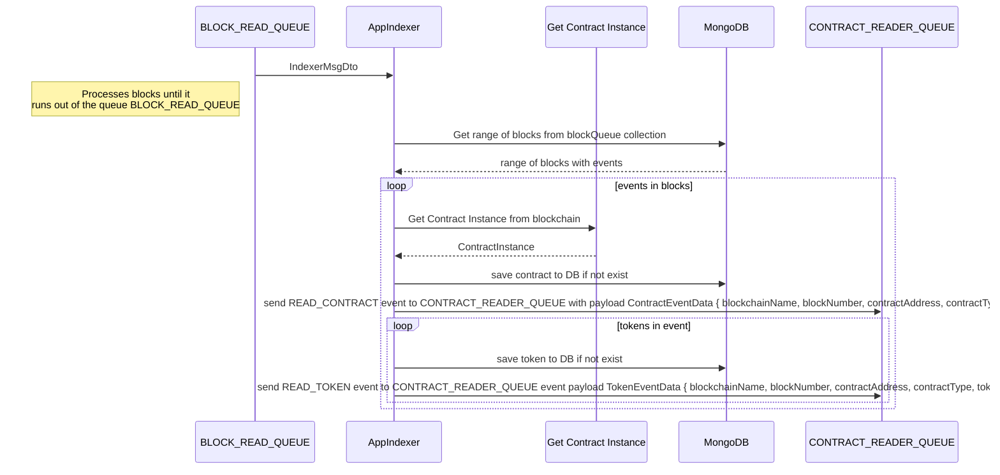

# app-indexer

## Description

Microservice based application that consumes [INDEX_BLOCK_RANGE events](https://github.com/LedgerHQ/nft-indexer-evm/blob/ffc4280f4438808024459372bc1861d1bd585982/src/app-indexer/token-processor/token-processor.controller.ts#L22) produced by [app-events-reader](https://github.com/LedgerHQ/nft-indexer-evm/tree/main/src/app-events-reader#readme).
App indexer read blocks range on INDEX_BLOCK_RANGE event and parse contracts and tokens data from blockchain save it to DB and send READ_CONTRACT and READ_TOKEN events to CONTRACT_READER_QUEUE.

## Data flow

Data flow how App indexer is working

INDEX_BLOCK_RANGE EVENT



### API

## Metrics endpoint

Replace `8080` with a value which was specified in `.env` file for `INDEXER_API_PORT`:

GET https://localhost:8080/metrics

### About metrics

metrics:<br/>
tasks_gauge - It's number of concurrent tasks<br/>
fetch_events_gauge - how much time it takes to fetch blocks range name from BD <br/>
store_token_gauge - how much time takes to update token entry in DB <br/>
store_contract_gauge - how much time takes to save contract entry in DB <br/>
events_gauge - how much events in blocks was processed<br/>
tokens_gauge - how much tokens was processed<br/>
event_counter - events counter<br/>
erc721_event_counter - erc721 events counter<br/>
erc1155_event_counter - erc1155 events counter<br/>
total_contract_counter - total contracts counter<br/>
erc721_contract_counter - erc721 contracts counter<br/>
erc1155_contract_counter - erc1155 contracts counter<br/>
erc721_token_counter - erc721 token counter<br/>
erc1155_token_counter - erc1155 token counter<br/>
stored_erc721_token_counter - succesfully stored erc721 token counter<br/>
stored_erc1155_token_counter - succesfully stored erc1155 token counter<br/>
stored_contract_counter - succesfully stored contract counter<br/>
duplicate_erc721_token_counter - duplicated erc721 token counter<br/>
duplicate_erc1155_token_counter - duplicated erc1155 token counter<br/>

## How to run

Before running locally, you need to run the components that App Indexer app interacts with in docker, and after that already run the `app-indexer` script:

### Local launch with RMQ (script: app-indexer)

```shell
$ git clone path/to/git/repository.git
$ npm i
$ npm run start:mongo
$ npm run start:rabbit
$ npm run app-indexer
```

## How to test

### Run all tests locally

```shell
$ npm run start:mongo
$ npm run test <you can specify a specific test file to run>
```

### Run all tests in Docker

```shell
$ npm run test:docker
```

###

A lot of tests use snapshots to compare results. If tests have changed and snapshots need to be recreated, then you need to use a special flag for this:

```shell
$ npm run test -- -u
```

---

## Interface

Event Queue Interface which consume events INDEX_BLOCK_RANGE<br/>
Event Queue Client which produce events READ_CONTRACT & READ_TOKEN

### DTO schemas

The App Indexer receives the IndexerDto object when working with the queue:
#INDEX_BLOCK_RANGE Payload

```typescript
export class IndexerDto {

  @IsPositive()
  @IsInt()
  public readonly blockFrom!: number;

  @IsPositive()
  @IsInt()
  public readonly blockTo!: number;

  @IsBoolean()
  public readonly reread!: boolean;
}
```

App Indexer emit events with following payloads:

#READ_CONTRACT

```typescript
export interface ContractEventData {
  blockchainName: Blockchain;
  blockNumber: number;
  contractAddress: string;
  contractType: TokenStandard;
}

export enum Blockchain {
  ETH = "eth",
}
export enum TokenStandard {
  ERC721 = "ERC-721",
  ERC1155 = "ERC-1155",
}
```

#READ_TOKEN

```typescript
export interface TokenEventData extends ContractEventData {
  tokenId: string;
}
```

### Events types

```typescript
export enum ServiceEvents {
  // Read blocks
  INDEX_BLOCK_RANGE = 'INDEX_BLOCK_RANGE',

  // Emit events
  READ_CONTRACT = 'READ_CONTRACT',
  READ_TOKEN = 'READ_TOKEN'
}
```

### Table schemas

#### note

Token id is composite key which consists of 3 parts ${blockchain}:${contractAddress}:${tokenId}.<br/>
Example eth:0x8Ce66fF0865570D1ff0BB0098Fa41B4dc61E02e6:0x0747 where eth is key of Ethereum blockchain.

#TOKEN SCHEMA

```typescript
export type Token = {
  _id: string;
  block: number;
  tokenUri: string | null;
  count: number;
  createdAt: Date;
  updatedAt?: Date | null;
};
```

#CONTRACT SCHEMA

```typescript
export type Contract = {
  _id: string;
  address: string;
  type: TokenStandard;
  name: string | null;
  block: number;
  createdAt: Date;
  updatedAt?: Date | null;
};
```

Example of the `contract` document:

```json
{
  "_id": "eth:0x9FB2EEb75754815c5Cc9092Cd53549cEa5dc404f",
  "address": "0x9FB2EEb75754815c5Cc9092Cd53549cEa5dc404f",
  "block": 14316461,
  "createdAt": {
    "$date": {
      "$numberLong": "1653925639144"
    }
  },
  "name": "Superlative Mutated Apes",
  "type": "ERC-721",
  "updatedAt": {
    "$date": {
      "$numberLong": "1654001190604"
    }
  }
}
```

Example of the `token` document:

```json
{
  "_id": "eth:0x8Ce66fF0865570D1ff0BB0098Fa41B4dc61E02e6:0x0747",
  "block": 14316462,
  "tokenUri": "https://bapesclan.mypinata.cloud/ipfs/QmZZbo8u8zEWg7wtmZhJS2W718WL6FA95T4XdgmCcLp1SJ/1863.json",
  "count": 1,
  "createdAt": {
    "$date": {
      "$numberLong": "1653925639685"
    }
  },
  "updatedAt": {
    "$date": {
      "$numberLong": "1654001191186"
    }
  }
}
```

## Dependencies

### Nestjs dependencies

#### Nest Overview

Nest (NestJS) is a framework for building efficient, scalable Node.js server-side applications. It uses progressive JavaScript, is built with and fully supports TypeScript (yet still enables developers to code in pure JavaScript) and combines elements of OOP (Object Oriented Programming), FP (Functional Programming), and FRP (Functional Reactive Programming).
See [nestjs](https://docs.nestjs.com/)

- [@nestjs/common](https://www.npmjs.com/package/@nestjs/common)
- [@nestjs/microservices](https://www.npmjs.com/package/@nestjs/microservices)
- [@nestjs/config](https://www.npmjs.com/package/@nestjs/config)
- [@nestjs/platform-express](https://www.npmjs.com/package/@nestjs/platform-express)
- [@nestjs/core](https://www.npmjs.com/package/@nestjs/platform-express)

### Other dependencies

- [prom-client](https://www.npmjs.com/package/prom-client) - a prometheus client for Node.js that supports histogram, summaries, gauges and counters;
- [ethers](https://www.npmjs.com/package/ethers) - a complete Ethereum wallet implementation and utilities in JavaScript (and TypeScript);
- [mongodb](https://www.npmjs.com/package/mongodb) - the official MongoDB driver for Node.js;
- [pino](https://www.npmjs.com/package/pino) - pino logger;
