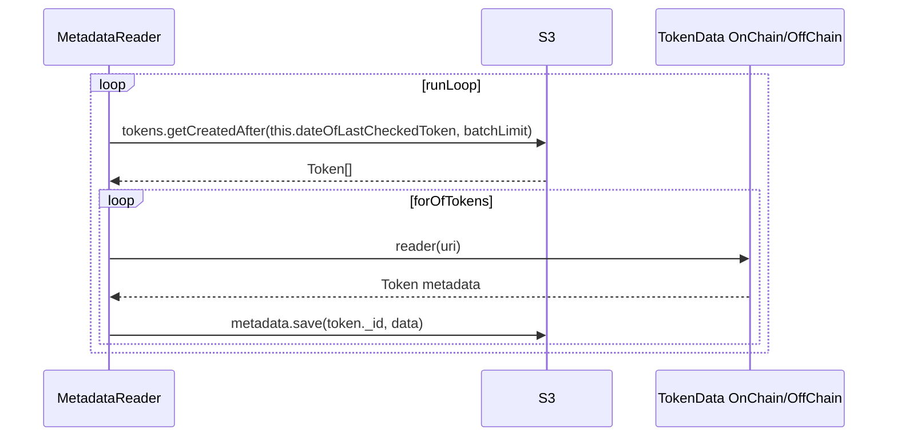
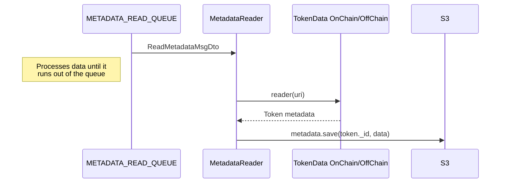

# metadata-reader
***
## Description

Metadata Reader is a microservice-based application whose main goal is to fetch the metadata of the tokens and write them to the database.
Metadata Reader can work with or without queues. There are two implementations:
- `npm run metadata-reader` - takes all the data it needs to work from the [tokens](#table-schemas) collection;
- `npm run metadata-reader:queue` - when working with the queue, it receives [DTOs](#dto-schemas) that contain all the necessary information for further processing. The [Contract Reader app](https://github.com/LedgerHQ/nft-indexer-evm/_insert_readme_link_) emits an [READ_METADATA event](https://github.com/LedgerHQ/nft-indexer-evm/_insert_readme_link_) and transmits the generated DTOs;

***
## Data flow
### Script metadata-reader
The Metadata Reader takes token data from the database in a loop and writes the resulting metadata to the database:

☝️ It's important to know: production runs use S3, development uses mongoDB
### Script metadata-reader:queue
The Metadata Reader takes the token data from the queue and writes the resulting metadata to the database:

☝️ It's important to know: production runs use S3, development uses mongoDB
***
## How to run

At the moment, the Metadata Reader app works as a CLI-application: all required inputs are transmitted via command line. For convenience, everything is already indicated in the script.
Input data used for the Metadata Reader app:
- `check-interval` - time interval after which new tokens are taken from the database;
- `workers` - number of concurrently executing asynchronous operations;
- `batch-limit` - the maximum number of records that we get from the database at a time;
- `run-loop` - only used when running without interacting with the queue;

Before starting the Metadata Reader app, it is possible to enable additional options (specified in .env):

- `PINATA_DEFAULT_GATEWAY=https://gateway.pinata.cloud` and `USE_PINATA=true` - start using Pinata gateway;
- `PROXY_CREDENTIALS=xxx` - when specifying credentials, all Axios requests go through a proxy;

### Local launch without queue (script: metadata-reader)

Before running locally, you need to run the components that Metadata Reader app interacts with in docker, and after that already run the `metadata-reader` script:
```shell
$ git clone path/to/git/repository.git
$ npm i
$ npm run start:mongo
$ npm run metadata-reader
```

### Local launch with RMQ (script: metadata-reader:queue)

```shell
$ git clone path/to/git/repository.git
$ npm i
$ npm run start:mongo
$ npm run start:rabbit
$ npm run metadata-reader:queue
```
###  Launch in Docker without queue
All other dependencies must also be running.
```shell
$ npm run metadata-reader:docker
```
###  Launch in Docker with RMQ
All other dependencies must also be running.
```shell
$ npm run metadata-reader:docker:queue
```
***
## How to test

### Run all tests locally
```shell
$ npm run start:mongo
$ npm run test <you can specify a specific test file to run>
```

### Run all tests in Docker
```shell
$ npm run test:docker
```

### 
A lot of tests use snapshots to compare results. If tests have changed and snapshots need to be recreated, then you need to use a special flag for this:
```shell
$ npm run test -- -u
```
***
## Interface

### DTO schemas

The Metadata Reader receives the ReadMetadataMsgDto object when working with the queue:
```typescript
export class ReadMetadataMsgDto {
  @IsEnum(Blockchain)
  public readonly blockchainName!: Blockchain;

  @IsNumber()
  public readonly blockNumber!: number;

  @IsString()
  public readonly contractAddress!: string;

  @IsString()
  public readonly contractName!: string;

  @IsEnum(TokenStandard)
  public readonly contractType!: TokenStandard;

  @IsString()
  public readonly tokenId!: string;

  @IsString()
  public readonly tokenUri!: string;
}
```

### Table schemas

Metadata Reader interacts with two MongoDB collections:
- `tokens` - contains information about all received tokens from the blockchain;
- `metadata` - contains all received metadata from tokens;

Example of the `tokens` document:
```json
{
  "_id": "eth:0xB2435253C71FcA27bE41206EB2793E44e1Df6b6D:0x56dbce",
  "block": 29580002,
  "tokenUri": "https://api.planetix.com/api/v1/pix/5692366",
  "count": 1,
  "createdAt": {
    "$date": {
      "$numberLong": "1655319331019"
    }
  }
}
```

Example of the `metadata` document:
```json
{
  "_id": "eth:0xB2435253C71FcA27bE41206EB2793E44e1Df6b6D:0x56dbca",
  "metadata": "{\"name\":\"CA OU#20231228\",\"description\":\"\",\"image\":\"https://static.planetix.com/KR8YlGQV6iPtUR5fTo7DlKD1dNW6n8FvaoNUJG51.png\",\"attributes\":[{\"trait_type\":\"NFT\",\"value\":\"PIX\"},{\"trait_type\":\"ID\",\"value\":\"8802580227fffff\"},{\"trait_type\":\"Coordinates\",\"value\":\"[-87.69282868584963,72.0766718164749]\"},{\"trait_type\":\"Classification\",\"value\":\"Desert / Tundra\"},{\"trait_type\":\"Tier\",\"value\":\"Outliers\"},{\"trait_type\":\"Country\",\"value\":\"CA\"}]}"
}
```
***
## Dependencies

### Nestjs dependencies
- [@nestjs/common ⇗](https://www.npmjs.com/package/@nestjs/common)
- [@nestjs/microservices ⇗](https://www.npmjs.com/package/@nestjs/microservices)
- [@nestjs/config ⇗](https://www.npmjs.com/package/@nestjs/config)
- [@nestjs/platform-express ⇗](https://www.npmjs.com/package/@nestjs/platform-express)
- [@nestjs/core ⇗](https://www.npmjs.com/package/@nestjs/platform-express)

### Other dependencies
- [prom-client ⇗](https://www.npmjs.com/package/prom-client) - a prometheus client for Node.js that supports histogram, summaries, gauges and counters;
- [ethers ⇗](https://www.npmjs.com/package/ethers) - a complete Ethereum wallet implementation and utilities in JavaScript (and TypeScript);
- [mongodb ⇗](https://www.npmjs.com/package/mongodb) - the official MongoDB driver for Node.js;
- [aws-sdk ⇗](https://www.npmjs.com/package/aws-sdk)
- [pino ⇗](https://www.npmjs.com/package/pino) - pino logger;
- [axios ⇗](https://www.npmjs.com/package/axios) - promise based HTTP client for the browser and node.js;
- [commander ⇗](https://www.npmjs.com/package/commander) - the complete solution for node.js command-line interfaces;

