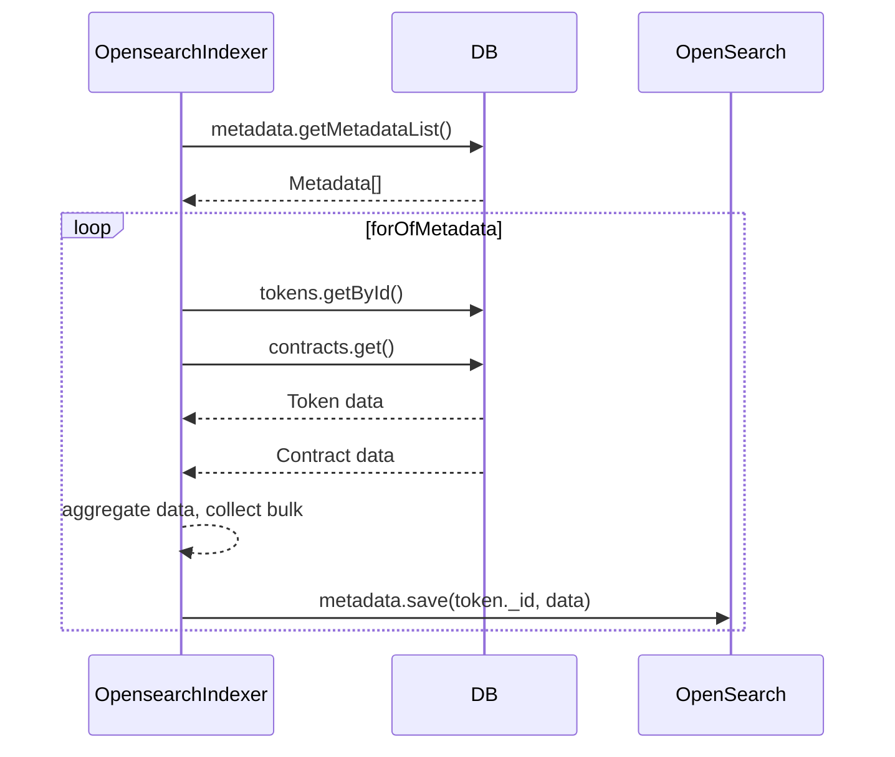

# opensearch-indexer
***
## Description

Opensearch Indexer is an cli application whose main goal is to fetch the metadata from mongo collection and write them to the opensearch index.


***
## Data flow
### Script opensearch-indexer
The Opensearch Indexer takes metadata data from the database in a loop, prepare data and writes the metadata to the index:

## How to run

At the moment, the Opensearch Indexer app works as a CLI-application.

### Local launch

Before running locally, you need to run the components that Metadata Reader app interacts with in docker, and after that already run the `metadata-reader` script:
```shell
$ git clone path/to/git/repository.git
$ npm i
$ npm run start:mongo
$ npm run app-opensearch-indexer
```

###  Launch in Docker
All other dependencies must also be running.
```shell
$ npm run app-opensearch-indexer:docker
```
## Dependencies

### Nestjs dependencies
- [@nestjs/common ⇗](https://www.npmjs.com/package/@nestjs/common)
- [@nestjs/microservices ⇗](https://www.npmjs.com/package/@nestjs/microservices)
- [@nestjs/config ⇗](https://www.npmjs.com/package/@nestjs/config)
- [@nestjs/platform-express ⇗](https://www.npmjs.com/package/@nestjs/platform-express)
- [@nestjs/core ⇗](https://www.npmjs.com/package/@nestjs/platform-express)

### Other dependencies
- [prom-client ⇗](https://www.npmjs.com/package/prom-client) - a prometheus client for Node.js that supports histogram, summaries, gauges and counters;
- [ethers ⇗](https://www.npmjs.com/package/ethers) - a complete Ethereum wallet implementation and utilities in JavaScript (and TypeScript);
- [mongodb ⇗](https://www.npmjs.com/package/mongodb) - the official MongoDB driver for Node.js;
- [aws-sdk ⇗](https://www.npmjs.com/package/aws-sdk)
- [pino ⇗](https://www.npmjs.com/package/pino) - pino logger;
- [axios ⇗](https://www.npmjs.com/package/axios) - promise based HTTP client for the browser and node.js;
- [commander ⇗](https://www.npmjs.com/package/commander) - the complete solution for node.js command-line interfaces;

