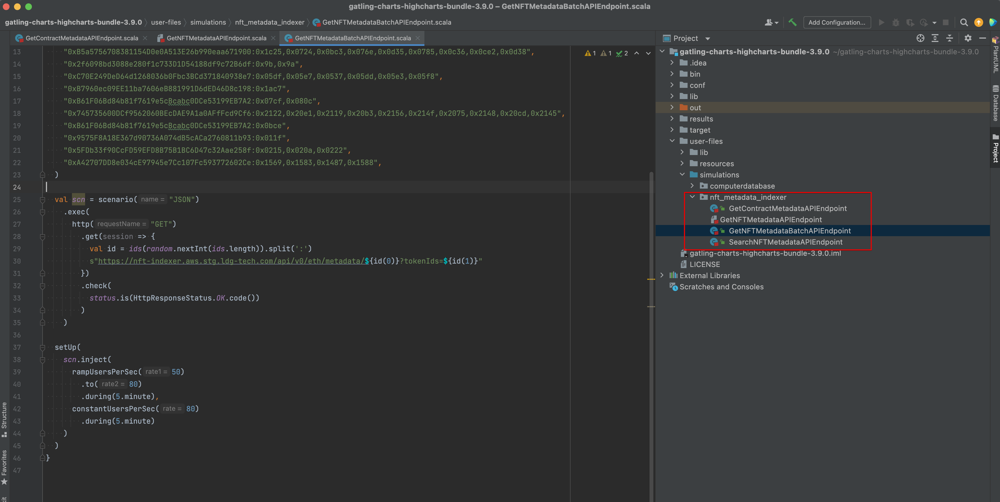
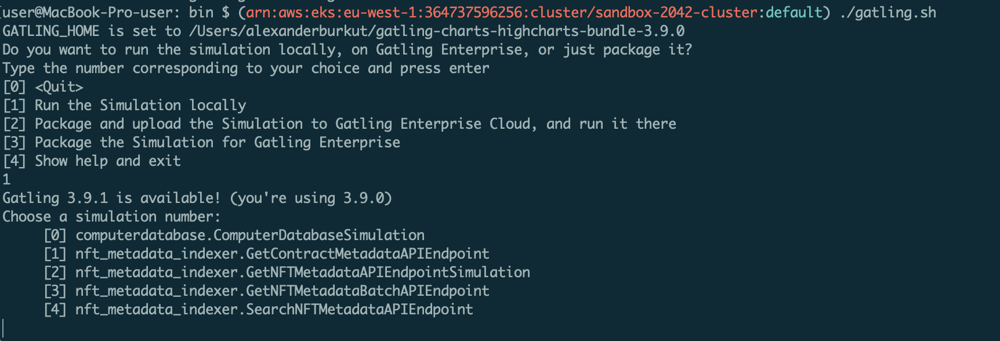
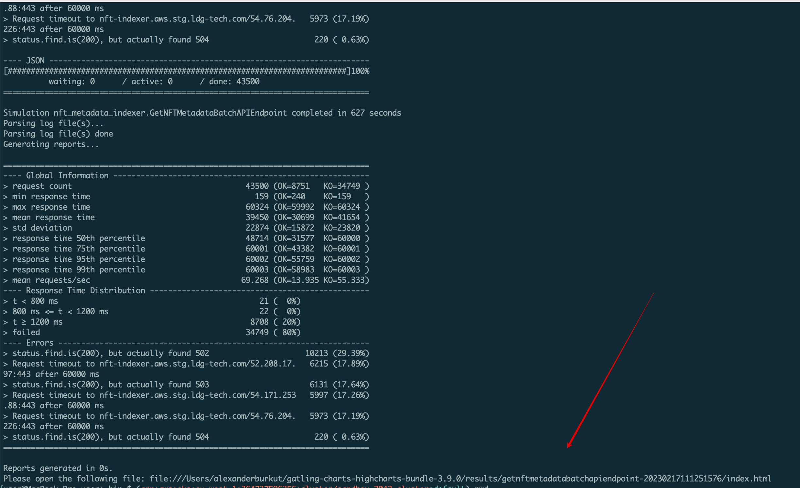

### Gatling.io Load and Performance testing:

- [Gatling load & performance simulation for GetNFTMetadata API endpoint](./simulations/GetNFTMetadataAPIEndpoint.scala)
- [Gatling load & performance simulation for GetNFTMetadataBatch API endpoint](./simulations/GetNFTMetadataBatchAPIEndpoint.scala)
- [Gatling load & performance simulation for GetContractMetadata API endpoint](./simulations/GetContractMetadataAPIEndpoint.scala)
- [Gatling load & performance simulation for SearchNFTs API endpoint](./simulations/SearchNFTMetadataAPIEndpoint.scala)

To download gatling locally follow instructions at https://gatling.io/open-source/ 

After this put [Gatling simulations](./simulations) into `/path/to/gatling/user-files/simulations/nft_metadata_indexer`:

As soon as the steps above are done you could run Gatling simulations from terminal `./path/to/gatling/bin/gatling.sh`:

Then choose Run the Simulation locally and select simulation you'd like to run.

When the simulation is finished (`10 minutes`) gatling outputs path to the report.
